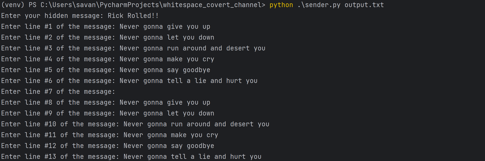
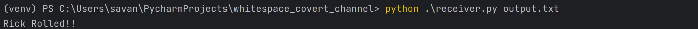

# Whitespace Covert Channel



## Description
A simple covert channel that inserts a hidden message within the whitespace at the end of a message. A tab denotes a 1
whereas a space indicates a 0 in a binary data string.

## Getting Started

### Dependencies
* Python3

### Installing
```
# Clone this repository
$ git clone https://github.com/sea7321/whitespace-covert-channel.git

# Go into the repository
$ cd whitespace-covert-channel
```

### Executing program

To use covert.py, follow the below commands to send an encoded message and decode a message from a file. You must 
specify the input/output filename. When encoding, you will be prompted to type in your hidden message as well as the
displayed message line by line.

```
# Send an encoded message
$ python3 sender.py <output_filename>
$ python3 sender.py output.txt

# Receive a decoded a message
$ python3 receiver.py <input_filename>
$ python3 receiver.py output.txt
```

## Author
Savannah Alfaro, sea2985@rit.edu